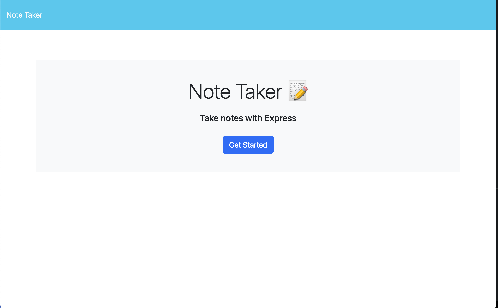
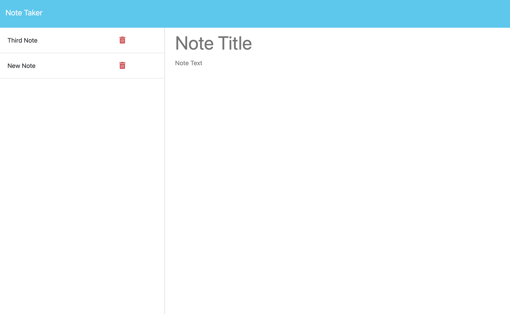
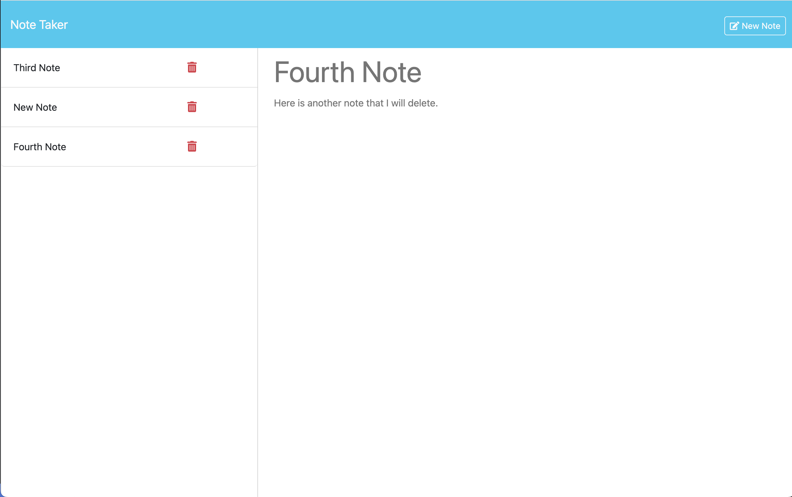
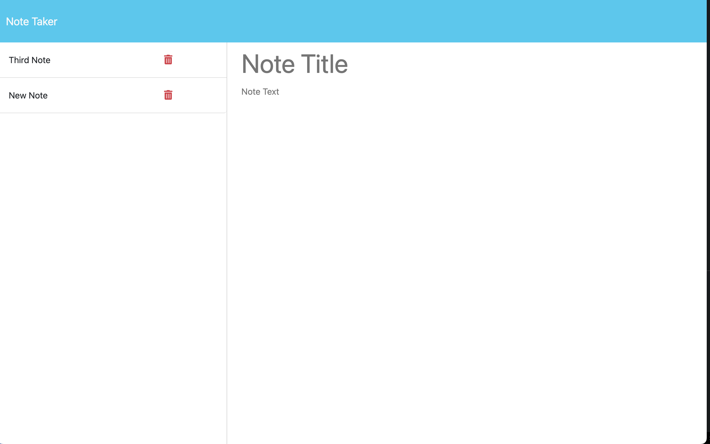

# Note Taker
  
## Description
  
This app is used to store notes. We used expressjs to setup the routes to make the starter code work as intended. We also used the fs package to store and recall saved notes.

 ## Questions

Here is a link to the project: [Note Taker](https://github.com/jarrodkrauszer/note_taker)
  
If you have any further questions you can email me at: [jarrod.krauszer@gmail.com](jarrod.krauszer@gmail.com)

